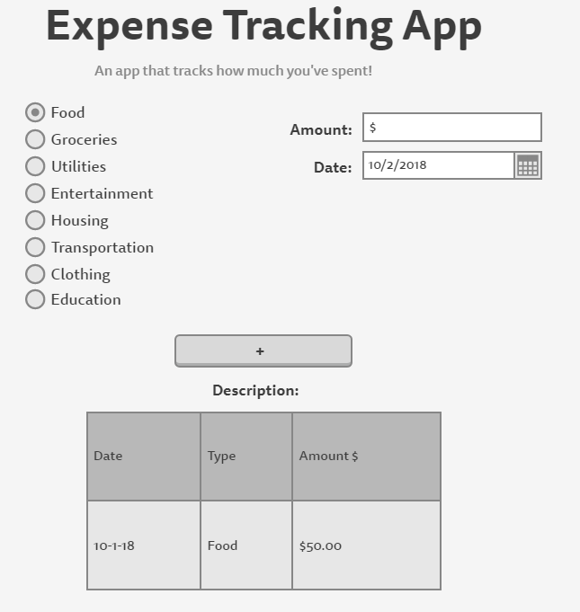
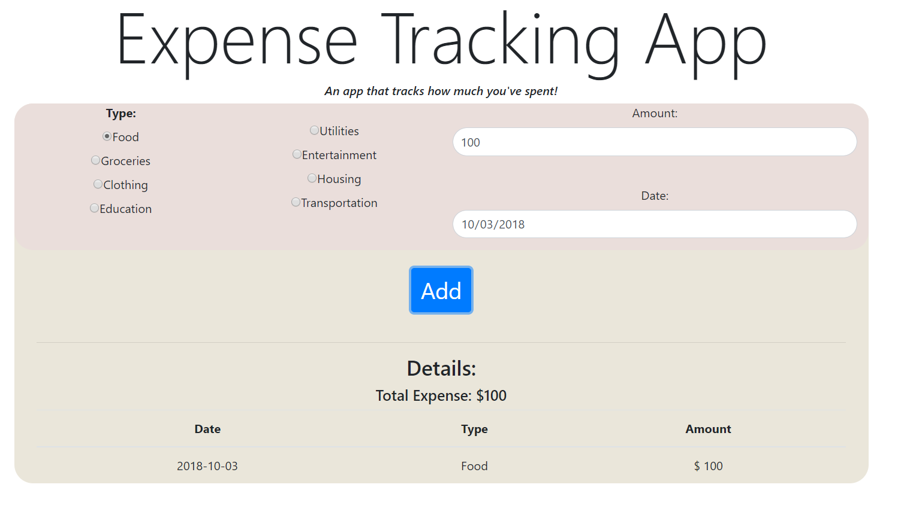
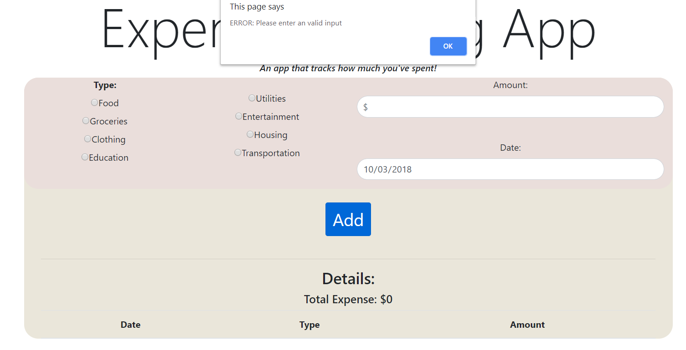

# Homework #2: Javascript, JQuery

For this assignment we were asked to learn the basic of Javascript and JQuery and use it along with the HTML, CSS, Bootstrap skills that we learned from homework #1 to create an interactive website that serve a purpose.

## Files
* [Demo webpage](./site/index.html)
* [CS460 repo](https://github.com/cli16/cli16.github.io/tree/master/CS460)

### First Step

After brainstorming for a few hours in designing what I should do, I finally decided on an expense tracking app that logs how much money did the user spent in an given date.
	
### Wireframe

Before begining to start coding the website, I first need to create an wireframe on how I should style and layout my webpage app. After a few quick searches on the internet, I came across this wireframe website: [Website wireframes: Mockingbird](https://www.gomockingbird.com/home). This website give the user the ability to create wireframe for free. With its easy-to-use GUI, I was able to get a better insight of how I should style my web page and how it would look like after it is done.
	
### Wireframe Photo


	
### Webpage
	
After I finish the wireframe, I went straight to the coding part, the HTML. I begin coding the user interface of my webpage carefully and piece by piece to make sure everything is just the way I wanted it to be. I make sure that every interactable forms and buttons can be indentify either by their class or adding an "id", so it can be easier be used in JQuery. I also tried to incorporate bootstrap into my webpage such as the button is using BootStrap primary button theme.

### Webpage HTML code

My html code:	
```
<!DOCTYPE html>
<html>
<head>
	<!-- rendering -->
	<meta name="viewport" content="width=device-width, initial-scale=1">
	
	<!-- my CSS -->
	<link rel="stylesheet" type="text/css" href="./style.css">

	<!-- Bootstrap4 stuff -->
	<link rel="stylesheet" href="https://maxcdn.bootstrapcdn.com/bootstrap/4.1.3/css/bootstrap.min.css">
	<script src="https://ajax.googleapis.com/ajax/libs/jquery/3.3.1/jquery.min.js"></script>
	<script src="https://cdnjs.cloudflare.com/ajax/libs/popper.js/1.14.3/umd/popper.min.js"></script>
	<script src="https://maxcdn.bootstrapcdn.com/bootstrap/4.1.3/js/bootstrap.min.js"></script>
	
	<!--JQuery--->
	<script src="https://ajax.googleapis.com/ajax/libs/jquery/3.3.1/jquery.min.js"></script>
	
	<title>Homework #2 | Expense Tracking App</title>
</head>


<body>
	<!-- content -->
	<div class="container text-center" id="title_form">
	<h1 class="display-1">Expense Tracking App</h1>
	<h6><em>An app that tracks how much you've spent!</em></h6>
	</div>

	<div class="container text-center" id="main_form">
	<div class="form-group">
	
		
		<div class="row" id="radioBoxGroup">
			<div class="col-md-3 text-center">		
			<label for="type" id="type_title">Type:</label>
			
			<div class=class="radio">
				<label><input type="radio" name="radioMethod" value="Food" >Food</label>
			</div>
			
			<div class=class="radio">
				<label><input type="radio" name="radioMethod" value="Groceries">Groceries</label>
			</div>
	
			<div class=class="radio">
				<label><input type="radio" name="radioMethod" value="Clothing">Clothing</label>
			</div>
		<label class="radio"><input type="radio" name="radioMethod" value="Education">Education</label>			
			</div>
			
			<div class="col-md-3 text-center">
			<br>
			<div class=class="radio">
				<label><input type="radio" name="radioMethod" value="Utilities">Utilities</label>
			</div>
			
			<div class=class="radio">
				<label><input type="radio" name="radioMethod" value="Entertainment">Entertainment</label>
			</div>
	
			<div class=class="radio">
				<label><input type="radio" name="radioMethod" value="Housing">Housing</label>
			</div>
		<label class="radio"><input type="radio" name="radioMethod" value="Transportation">Transportation</label>			
			</div>		
				
			<div class="col-md-6 text-center">			
		<div class="form-group">
		<label for="MoneyAmount">Amount:</label>
		<input type="number" class="form-control" id="money_input" placeholder="$">
	</div>
	<br>
	<label for="date">Date:</label>
	<div class="form-group row">
		<div class="col-12">
		<input class="form-control" type="date" value="2018-10-03" id="date_picker">
		</div>
	</div>

	</div>
		
		</div>
		<br>
		<input type="button" class="btn btn-primary " id="button_add"  value="Add">
	<!--<p id="error_text" "display:none" test</p>-->
	
	<!-- detail tables -->
	<div class="container text-center" id="details">
	<br><hr/>
	<h3>Details:</h3>
	<h5>Total Expense: $<a id="totalAmount">0</a></h5> 
	<table class="table table-hover" id="details1">
		<thead>
			<tr>
			<th>Date</th>
			<th>Type</th>
			<th>Amount</th>
			</tr>
		</thead>	
	</div>
</div>

	<!-- my JQuery script-->
	<script src="Jscript.js"></script>
	
</body>
</html>
```

### Javascript & JQuery

In my opinion, Javascript is the most funnest part of this assignment. Prior to this assignment, I have never worked with Javascript before. From doing this assignment, I learned that javascript have many uses. I was able to play around and experience with different javascript codes on [W3Schools](http://w3schols.com) before coding my javascript functions myself. I realized that javascript is somewhat familar to C++, therefore I have no problem in writing Javascript. In my Javascript, I have written 5 functions that run the core of my expense tracking app.
* "addBudget(value)" -> add and caluate the user input. 
* "getSelectedRadioValue()"-> get and return the user radiobox input.
* "addTableRows(date, amount, type)" -> take in 3 parameters: date, amount, type, and logs the record into the table
* "getDate()" -> get the user picked date. 
* "$("#button_add")" -> a button to wrap up all the function calls (helper function).
		
### Javascript & JQuery code
Below is the core script that runs my webpage app:

```
var inputAmount = 0
var totalAmount = 0
var selectedOption = "error"
var pickDate;

	//$("#money_input").val(totalAmount + 200000);
	//alert($(.radio-inline[0]).val)	
	//alert(result.innerHTML = 'You selected: '+radVal);	

function addBudget(value)
{
	//check and see if money input is less than 0
	if (value < 0 || value == "" )
	{
		alert ("ERROR: Please enter an valid input");
		//$("#error_text").hide();
	}
	if (selectedOption == "error")
	{
		alert ("You must select the type.");		
	}
	inputAmount = value;
	totalAmount = +totalAmount + +inputAmount; //add plus sign to indict integers
	
	//update the webpage total Amount
	$("#totalAmount").text(totalAmount);
}	
	
function getSelectedRadioValue()
{
	var radioBoxes = document.getElementsByName("radioMethod");
	
	//loop thru each and check checked optins	
	for (var counter = 0; counter < radioBoxes.length; counter++)
	{
			if(radioBoxes[counter].checked)
				{
					selectedOption = radioBoxes[counter].value
					//alert(radioBoxes[counter].value);
					break;
				}
	}
}

//add rows to the table. Pass in 3 parameters
function addTableRows(date, amount, type)
{
	if (amount != ""){
	$("#details1").append("</tbody><tr><td>" + date + "</td><td>" + type + "</td><td>" + "$ "+ amount + "</td></tr></tbody>");
	}
}


function getDate()
{
	pickDate = $("#date_picker").val();
}

//add button function
$("#button_add").click(function() {

	getDate()
	getSelectedRadioValue();
	addBudget($("#money_input").val());
	//$("#details").hide();
	addTableRows(pickDate, inputAmount, selectedOption);
});
```

### CSS code
Below is my webpage's CSS code

```
#button_add{
	font-size: 30px;
}

#type_title{
	font-weight: bold;
}

#main_form{
	background-color: #EAE6DA;
	border-radius: 25px;
}

#title_form{
	
	border-radius: 25px;
}

#radioBoxGroup{
	
	border-radius: 25px;
	background: #EADEDB
}

input[type=number]  {
    padding:5x 5px;
    display:inline-block;
    border-radius: 20px;
}

input[type=date] {
    padding:5px 5px;
    display:inline-block;
    border-radius: 20px;
}
```

### Final Webpage Screenshot

