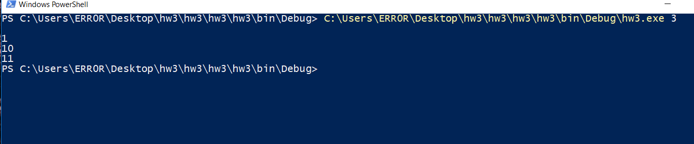
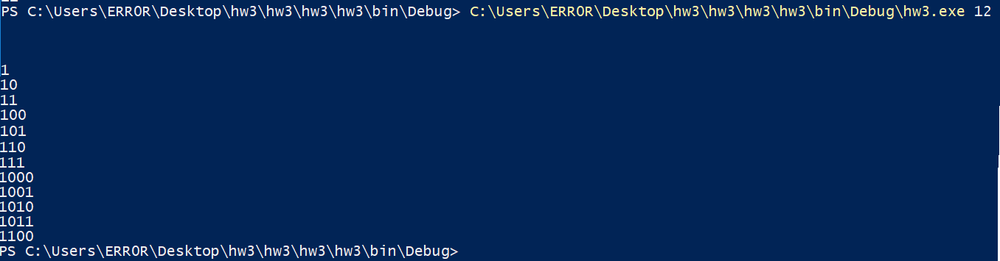

### Homework #3: Convert Java Program Into C# Program

For this assignment we were asked to translate a java program into a C# program. And also to learn how to use the tools offered in Visual Studio IDE.
In doing this project, I found out that the java and C# language are very similar to each other.  


## Files
* [HW3 Code](https://github.com/cli16/cli16.github.io/tree/master/CS460/hw3/hw3/hw3/hw3)
* [CS460 repo](https://github.com/cli16/cli16.github.io/tree/master/CS460)

### Getting Started
For this assignment, we were asked to use only Viusal Studio Community 2017 IDE. I downloaded the IDE by going to [Visual Studio IDE](https://visualstudio.microsoft.com/downloads/) . After I installed Visual Studio, I created my program by choosing the "Console App (.NET Framework)" option, since one of the requirements for this assignment is to run the program in a terminal.

### Translation #1: Node.java -> Node.cs
After I chosen the type of program that I wanted to create. I then begin to translate the Node.Java in to C#:
this part of the code is easy to translate because the syntax are the same in both Java and C#.
Node.cs:
```
using System;

namespace hw3
{
    public class Node<T>
    {
        public T data;
        public Node<T> next;

        public Node(T data, Node<T> next)
        {
            this.data = data;
            this.next = next;
        }
    }
}
```

### Translation #2: QueueInterface.java -> QueueInterface.cs
The code in this part are also the same in both languages.
QueueInterface.cs:
```
using System;

namespace hw3
{
    class QueueInterface
    {
        public interface queueInterface<T>
        {
            T push(T element);
            T pop();
            bool isEmpty();
        }
    }
}
```

### Translation #3: QueueUnderflowException.java -> QueueUnderflowException.cs
In this part of the code, only the "super()" syntax is different in C#.
In java the syntax "super()" is equivalent to "base()" in C#.
QueueUnderflowException.cs:
```
using System;

namespace hw3
{
    class QueueUnderflowException : SystemException
    {
        public QueueUnderflowException() : base()
        { 
        }

        public QueueUnderflowException(string message) : base(message)
        {
        }
    }
}
```

### Translation #4: LinkedQueue.java -> LinkedQueue.cs
In this part of the code, the "implements" syntax is equivalent to ":" in C#.
```
using System;
using System.Collections.Generic;
using System.Linq;
using System.Text;
using System.Threading.Tasks;


namespace hw3
{
    class LinkedQueue<T> : QueueInterface
    {
        private Node<T> front;
        private Node<T> rear;

        public LinkedQueue()
        {
            front = null;
            rear = null;
        }

        public T push(T element)
        {
            if (element == null)
            {
                throw new System.ArgumentNullException();
            }

            if (isEmpty())
            {
                Node<T> tmp = new Node<T>(element, null);
                rear = front = tmp;
            }
            else
            {
                ///general case
                Node<T> tmp = new Node<T>(element, null);
                rear.next = tmp;
                rear = tmp;
            }
            return element;
        }

        public T pop()
        {
            T tmp;
            if (isEmpty())
            {
                throw new QueueUnderflowException("The queue was empty when pop was invoked.");
            }
            else if (front == rear)
            {
                ///if one item in queue
                tmp = front.data;
                front = null;
                rear = null;
            }
            else
            {
                ///general case
                tmp = front.data;
                front = front.next;
            }
            return tmp;
        }
     

        public bool isEmpty()
        {
            if (front == null && rear == null)
            {
                return true;
            }
            else
            {
                return false;
            }

        }
    }
}
```

### Translation #5: main.java -> Program.cs
In this part of the code, there are several syntaxes that needed to be changed.
The "System.out.print" syntax is equivalent to "Console.Out.Write".
The "System.out.println" syntax is equivalent to "Console.Out.WriteLine".
The "n = Integer.parseInt(args[0])" syntax is equivalent to "n = Int32.Parse(args[0])".
The "int maxLength = output.getLast().length()" syntax is equivalent to "int maxLength = output.Last.Value.Length".

Program.cs:
```
using System;
using System.Collections.Generic;
using System.Linq;
using System.Text;
using System.Threading.Tasks;
namespace hw3
{
    class Program
    {
        static LinkedList<string> generateBinaryRepresentationList(int n)
        {

            //create an empty queue of strings with which to perform the traversal
            LinkedQueue<StringBuilder> q = new LinkedQueue<StringBuilder>();

            //A list for returning the binary values
            LinkedList<string> output = new LinkedList<string>();

            if (n < 1)
            {
                //binary representation of negative values is not supported
                //return an empty list
                return output;
            }

            //Enqueue the first binary number. Use a dynamic string to avoid string concat
            q.push(new StringBuilder("1"));

            //BFS
            while (n-- > 0)
            {
                //print the front of the queue
                StringBuilder sb = q.pop();
                output.AddLast(sb.ToString());

                //make a copy
                StringBuilder sbc = new StringBuilder(sb.ToString());

                //left child
                sb.Append('0');
                q.push(sb);

                //right child
                sbc.Append('1');
                q.push(sbc);
            }
            return output;
        }

        //driver program to test above function

        public static void Main(string[] args)
        {
            int n = 10;
            if (args.Length < 1)
            {
                Console.Out.WriteLine("Please invoke with the max value to print binary up to, like this: ");
                Console.Out.WriteLine("\thw3.exe 12");
                return;
            }
            try
            {
                n = Int32.Parse(args[0]);
            }
            catch (FormatException e)
            {
                Console.Out.WriteLine("I'm sorry, I can't understand the number: " + args[0]);
                return;
            }
            LinkedList<string> output = generateBinaryRepresentationList(n);

            //print it right justified. Longest string is the last one.
            //print enough spaces to move it over the correct distance

            //get lastn ode value lenght
            int maxLength = output.Last.Value.Length;

            foreach (string s in output)
            {
                for (int i = 0; i < maxLength - s.Length; ++i)
                {
                    Console.Out.Write(" ");
                }
                Console.Out.WriteLine(s);
            }
        }
    }
```

### Screenshots

