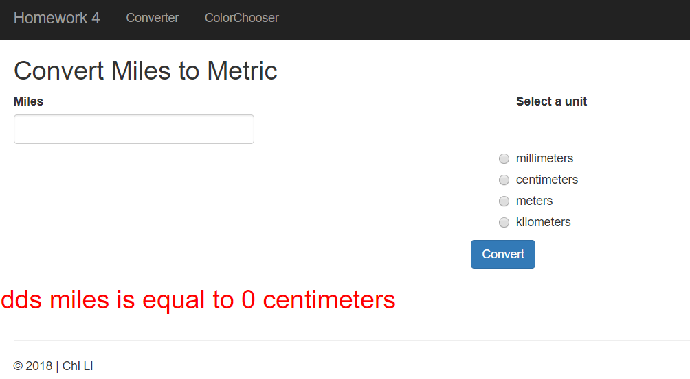
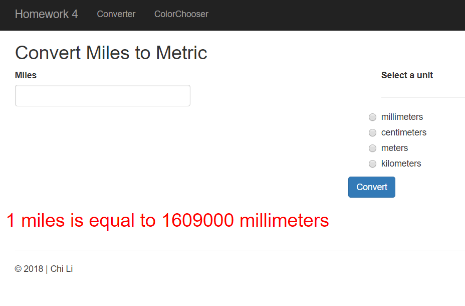
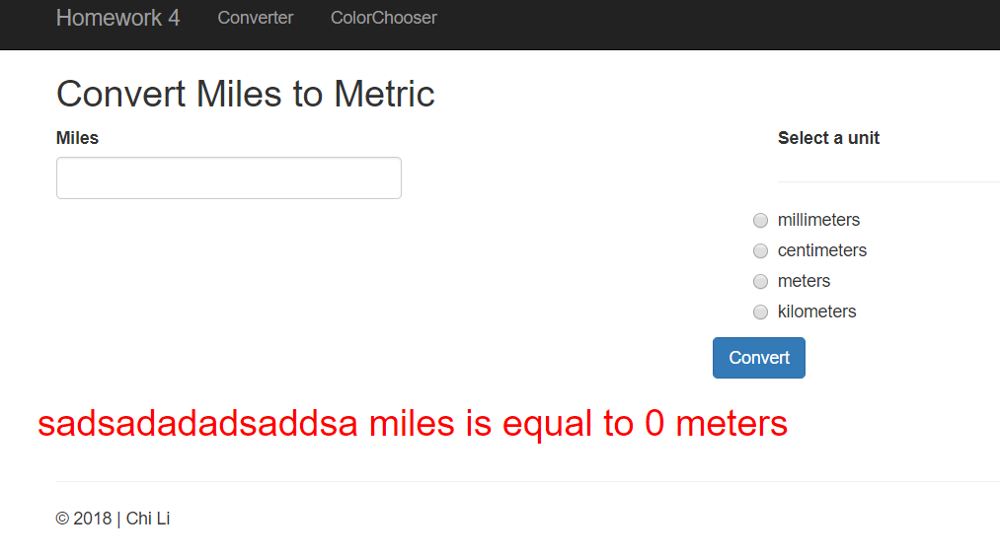
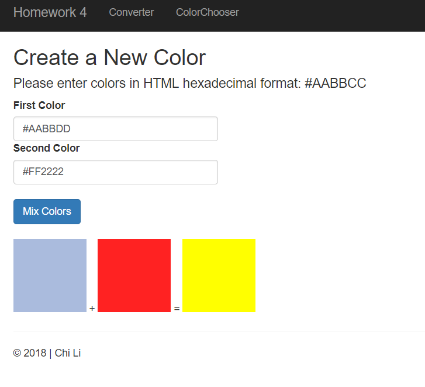

### Homework 4
For this assignment, we were asked to write a MVC application using ASP.net. In this assignment, we are required to use GET and POST methods when creating the color mixer and converter page. 


## Files
* [HW4 Code](https://github.com/cli16/cli16.github.io/tree/master/CS460/hw4)
* [CS460 repo](https://github.com/cli16/cli16.github.io/tree/master/CS460)

### Getting Started
For this assignment, we were asked to use only Viusal Studio Community 2017 IDE. I downloaded the IDE by going to [Visual Studio IDE](https://visualstudio.microsoft.com/downloads/) . After I installed Visual Studio, I created my program by choosing the "Web -> ASP.NET Web Application(.NET FrameWork)" option and then I choose the MVC option.

### Code: Index.cshtml
For the Index.cshtml(index page), I just modified the text and the url for buttons from the default template.
Note that the razer html code the format of is: @Html.AcionLink(<text>, <ViewsName>,<controllersName>) 

```
@{
    ViewBag.Title = "Homework 4 | Home Page";
}

<div class="jumbotron">
    <h1>CS460 Homework 4</h1>
    <p class="lead">Homework 4 is all about learning the basics of GET, POST, Query Strings and MVC.</p>
    
</div>

<div class="row">
    <div class="col-md-6">
        <h2>Mile to Metric Converter</h2>
        <p>
            Want to know how many milemeters there are in 26 miles? This calculator
            is for you. Using query strings to send form data to the server, which performs the calculation
            and returns the answer in the requested page.
        </p>
        <p><a class="btn btn-default" @Html.ActionLink("Try it out >>", "converter", "Home") </a></p>
    </div>
    <div class="col-md-6">
        <h2>Color Chooser</h2>
        <p>Typical online color choosers are way too useful. We wanted something fun and completely useless. This form POST's the data to the server.</p>
        <p><a class="btn btn-default" @Html.ActionLink("Try it out >>", "ColorChooser", "Color") </a></p>
    </div>
</div>
```

### Code: _Layout.cshtml
This document consists of global declarattion of designs. In this document, I changed the title, url of the navigation bar and the footer text.
```
<!DOCTYPE html>
<html>
<head>
    <meta charset="utf-8" />
    <meta name="viewport" content="width=device-width, initial-scale=1.0">
    <title>@ViewBag.Title | Homework 4</title>
    @Styles.Render("~/Content/css")
    @Scripts.Render("~/bundles/modernizr")
</head>
<body>
    <div class="navbar navbar-inverse navbar-fixed-top">
        <div class="container">
            <div class="navbar-header">
                <button type="button" class="navbar-toggle" data-toggle="collapse" data-target=".navbar-collapse">
                    <span class="icon-bar"></span>
                    <span class="icon-bar"></span>
                    <span class="icon-bar"></span>
                </button>
                @Html.ActionLink("Homework 4", "Index", "Home", new { area = "" }, new { @class = "navbar-brand" })
            </div>
            <div class="navbar-collapse collapse">
                <ul class="nav navbar-nav">
                    <li>@Html.ActionLink("Converter", "converter", "Home")</li>
                    <li>@Html.ActionLink("ColorChooser", "colorchooser", "Color")</li>
                </ul>
            </div>
        </div>
    </div>
    <div class="container body-content">
        @RenderBody()
        <hr />
        <footer>
            <p>&copy; @DateTime.Now.Year | Chi Li</p>
        </footer>
    </div>

    @Scripts.Render("~/bundles/jquery")
    @Scripts.Render("~/bundles/bootstrap")
    @RenderSection("scripts", required: false)
</body>
</html>
```

### Code: Converter.cshtml
For this part, we were asked to only use GET method. So, I create the input form to get the user inputs and make sure that the form method is GET, so that the form will return an Query String in the URI when user click the convert button. Also, the overall input form is wrapped with Bootstrap.
```

@{
                /**/

                ViewBag.Title = "Converter";
}

<h2>Convert Miles to Metric</h2>
<div class="row">
    <form action="" method="get">
        <div class="col-md-6">
            <label for="miles">Miles</label><br />
            <input type="text" name="miles" id="milesInput" class="form-control" />

        </div>
        <div class="col-md-6">

            <label for="units">Select a unit</label>
            <hr />
            <div class="radio">
                <labal><input type="radio" name="units" value="millimeters">millimeters</labal>
            </div>

            <div class="radio">
                <labal><input type="radio" name="units" value="centimeters">centimeters</labal>
            </div>

            <div class="radio">
                <labal><input type="radio" name="units" value="meters">meters</labal>
            </div>

            <div class="radio">
                <labal><input type="radio" name="units" value="kilometers">kilometers</labal>
            </div>

        </div>

        <br />
        <center><button type="submit" class="btn btn-primary">Convert</button></center>
        <h2><font color="red">@ViewBag.result</font></h2>
    </form>
</div>
```

### Code: HomeController.cs
I believe that Controllers is the most important document of the application. It's where all the core logic and routes are. For the converter page (aka, or when the user click the "convert" button on that page) the controller allows the application to grab the user inputs using C#'s Request.QueryString to grab the input data from the URI. In this document, I used C# "if" statements to determine which radiobox option did the user picks and convert the input with it. Also, the razer code (@ViewBag.<name>) is very useful since it can work with html and pass value around.
```
using System;
using System.Collections.Generic;
using System.Linq;
using System.Web;
using System.Web.Mvc;
using System.Diagnostics;
using System.Drawing;

namespace hw4.Controllers
{
    public class HomeController : Controller
    {
        public ActionResult Index()
        {
            return View();
        }

        public ActionResult Converter()
        {
            string miles = "NULL";
            miles = Request.QueryString["miles"];
            double milesValue;
            if (double.TryParse(miles, out milesValue))
            {
                 milesValue = Convert.ToDouble(miles); //convert string into double
            }

            double result = -1;
            string radioOption = "NULL";
            radioOption = Request.QueryString["units"];

            //convertion formula
            const double MILLIMETERS = 1609000;
            const double CENTIMETERS = 160934;
            const double METERS = 1609.34;
            const double KILOMETERS = 1.60934;

            if (miles != null && radioOption != null)
            {
                //check for selected option
                if (radioOption == "millimeters")
                {
                    milesValue *= MILLIMETERS;
                }

                if (radioOption == "centimeters")
                {
                    milesValue *= CENTIMETERS;
                }

                if (radioOption == "meters")
                {
                    milesValue *= METERS;
                }

                if (radioOption == "kilometers")
                {
                    milesValue *= KILOMETERS;
                }

                //result
                result = milesValue;
                ViewBag.result = miles + " miles is equal to " + result + " " + radioOption;

            }

            return View();
        }

    }
}
```

### Code: ColorController.cs
Similar to HomeController, this document import the code logic and functionality of my colormixer page. In this Controller document, I declared two "public ActionResult ColorChooser()", one is for the GET method(HttpGet) and the other is for the POST method(HttpPost). For the HttpPost, we dont have to use the "Request.QueryString" function , since the querystring automatically get passed when we overload the ActionResult function like this: public ActionResult ColorChooser(string firstColorHex, string secondColorHex).	The overall logic of this document is that I first grab the user's input and convert it into ARGB value and add them together, and if the result exceeded 255, it'll return 255 as the result. Once it's done, it'll get converted back into hex to be passed onto the html using @ViewBag.
```
using System;
using System.Collections.Generic;
using System.Linq;
using System.Web;
using System.Web.Mvc;
using System.Drawing;

namespace hw4.Controllers
{
    public class ColorController : Controller
    {
        [HttpGet] //when page loads
        public ActionResult ColorChooser()
        {
            // ViewBag.testing = firstColor;

            return View();
        }

        [HttpPost] //when clicked submit
        public ActionResult ColorChooser(string firstColorHex, string secondColorHex)
        {
            //convert to gba then calculates and then convert back to hex
            Color firstColor = ColorTranslator.FromHtml(firstColorHex);
            Color secondColor = ColorTranslator.FromHtml(secondColorHex);


            //ViewBag.testing = ColorTranslator.ToHtml(Color.Red);
            Color resultColorRGB = Color.FromArgb(firstColor.A, 11, 255, 255);

            int resultColorR = 0;
            int resultColorG = 0;
            int resultColorB = 0;

            //color mixing R
            if (firstColor.R + secondColor.R > 255)
            {
                resultColorR = 255;
            }
            else
            {
                resultColorR = firstColor.R + secondColor.R;
            }

            //G
            if (firstColor.G + secondColor.G > 255)
            {
                resultColorG = 255;
            }
            else
            {
                resultColorG = firstColor.G + secondColor.G;
            }

            //G
            if (firstColor.B + secondColor.B > 255)
            {
                resultColorB = 255;
            }
            else
            {
                resultColorG = firstColor.B + secondColor.B;
            }

            resultColorRGB = Color.FromArgb(firstColor.A, resultColorR, resultColorG, resultColorB);

            //convert back to hex
            string resultColorHex = string.Format("{0:X2}{1:X2}{2:X2}", resultColorR, resultColorG, resultColorB);


            ViewBag.firstColor = firstColorHex;
            ViewBag.secondColor = secondColorHex;
            ViewBag.resultColor = "#" + resultColorHex;
            //ViewBag.result = "#"+ colorHex;


            return View();
        }
    }
}
```

### Code: COlorChooser.cshtml
In this page, we are required to only uses razer html helper for the form inputs. Therefore, all the form inputs begin with a @, such as: @Html.Label. Also, I made the result to only get displayed when the method is POST(when user clicked the 'Mix Color' button) by using a simple checking function, if(IsPost).
```

@{
    ViewBag.Title = "ColorChooser";
}

<h2>Create a New Color</h2>
<h4>Please enter colors in HTML hexadecimal format: #AABBCC</h4>


@using (Html.BeginForm("ColorChooser", "Color", FormMethod.Post))
{
    @Html.Label("firstColorHex", "First Color")
    @Html.TextBox("firstColorHex", null, htmlAttributes: new
{
    @class = "form-control",
    type = "text"
    })

    @Html.Label("secondColorHex", "Second Color")
    @Html.TextBox("secondColorHex", null, htmlAttributes: new
{
    @class = "form-control",
    type = "text"
    })
    <br />
    <button type="submit" class="btn btn-primary">Mix Colors</button>
    <br />


    //if post method
    if (IsPost)
    {

        <br />
        <div class="col-container" width: 100%>
            <div style="display: inline-block; height:100px; width:100px; background-color:@ViewBag.firstColor"></div>
            +
            <div style="display: inline-block; height:100px; width:100px; background-color:@ViewBag.secondColor"></div>
            =
            <div style="display: inline-block; height:100px; width:100px; background-color:@ViewBag.resultColor"></div>
        </div>
    }


    // @ViewBag.testing
}
```

### Screenshots



