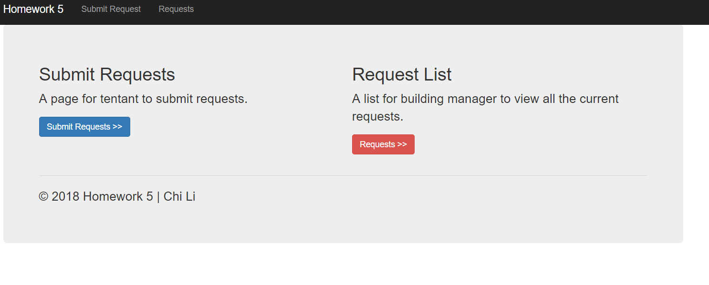
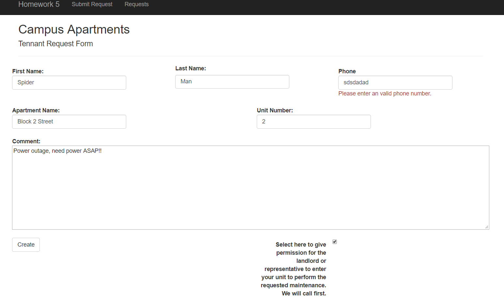
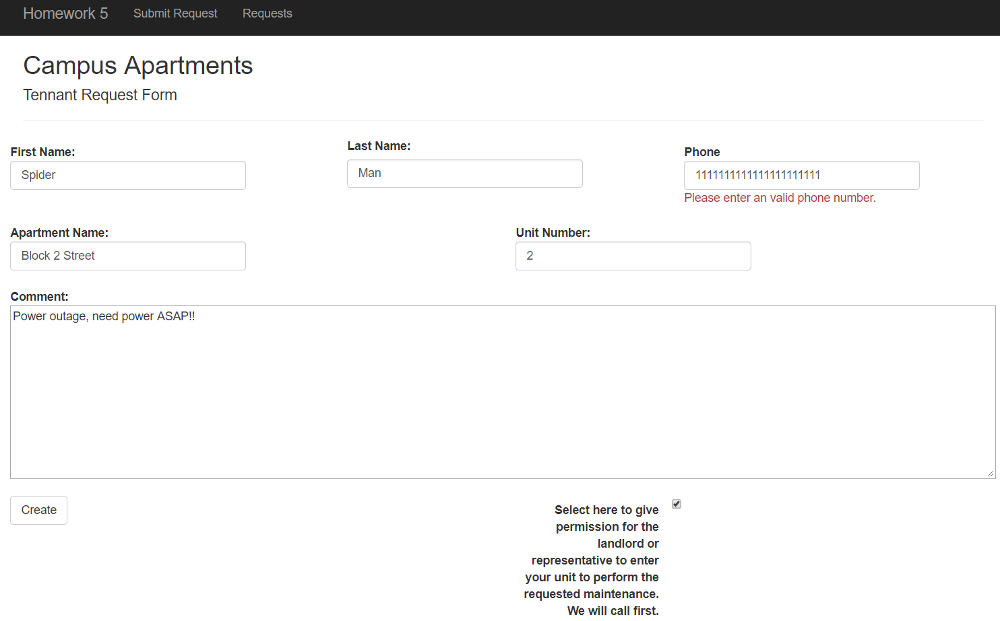
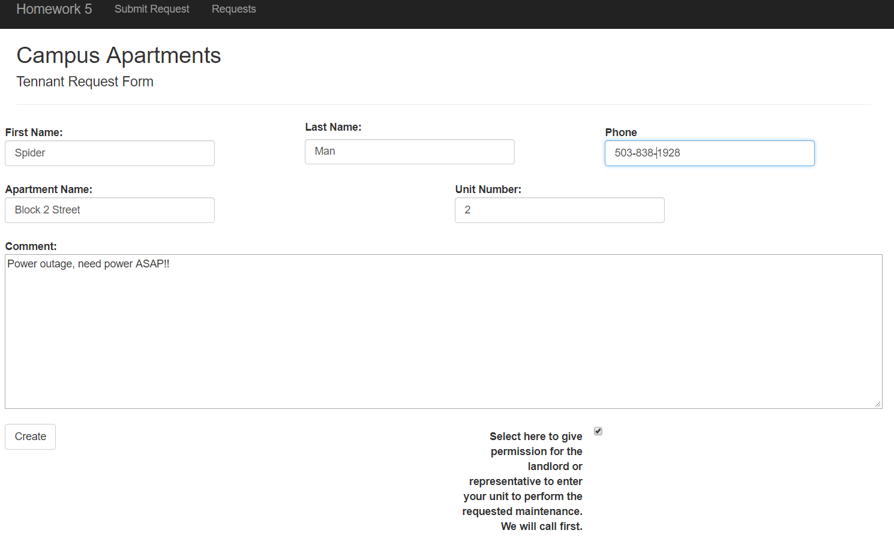
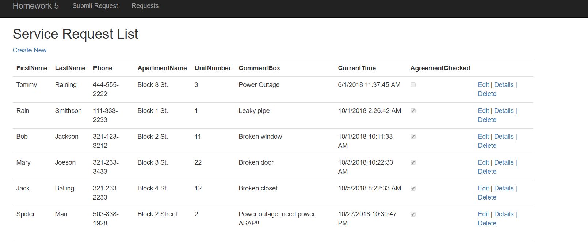

### Homework #5 MVC & Database
For this assignment, we need to create a interactive site for campus tentants to submit their request for serivces using MVC and database.

## Files
* [HW5 Code](https://github.com/cli16/cli16.github.io/tree/master/CS460/hw5)
* [CS460 repo](https://github.com/cli16/cli16.github.io/tree/master/CS460)

### Getting Started
For this assignment, we were asked to use only Viusal Studio Community 2017 IDE. I downloaded the IDE by going to [Visual Studio IDE](https://visualstudio.microsoft.com/downloads/) . After I installed Visual Studio, I created my program by choosing the "Web -> ASP.NET Web Application(.NET FrameWork)" option and then I choose the MVC option.

### Model
After I created my application using the default MVC template, the second step that I took is to create the model class(Renter.cs). In this model file, I listed out all the variables that I'm going to use in the application. and I label all the required inputs that user needed to enter using the [Required] rules. For the phone number input validation check, RegularExpression to check if the phone number is valid or not. Also, for the submitation timestamp I use the DateTime.Now function to get the time of user submitation timestamp.
```
using System;
using System.Collections.Generic;
using System.Linq;
using System.Web;
using System.ComponentModel.DataAnnotations;
namespace hw5.Models
{
    public class Renter
    {
        [Key]
        public int Id { get; set; }

        [Required]
        public string FirstName { set; get; }

        [Required]
        public string LastName { set; get; }

        [Required]
        [RegularExpression(@"^\(?([0-9]{3})\)?[-. ]?([0-9]{3})[-. ]?([0-9]{4})$", ErrorMessage = "Please enter an valid phone number.")]
        public string Phone { set; get; }

        [Required]
        public string ApartmentName { set; get; }

        [Required]
        public int UnitNumber { set; get; }

        [Required]
        public string CommentBox { set; get; }

        //get timestamp
        public DateTime GetCurrentTime = DateTime.Now;

        public DateTime CurrentTime
        {
            set { GetCurrentTime = value; }
            get { return GetCurrentTime; }

        }

        //[Required(ErrorMessage = "You must agree to the agreement, in order for us to provide the service to you.")]
        public bool AgreementChecked { set; get; }
    }
}
```
### Entity Framework
After I finished writing the model class, I installed Entity Framework by going to Tools-> Nuget package manager. Entity Framework helped me with the create and list request page by automatically generated those pages.

### Database & DAL(Data Access Layer)
For this part, in order to connect to the database I needed to added connection string to the web.config file. Below are the code of my connection string:
```
<connectionStrings>
    <add name="Data" connectionString="Data Source=(LocalDB)\MSSQLLocalDB;AttachDbFilename=C:\Users\ERR0R\Desktop\CS460\CS460\hw5\hw5\hw5\App_Data\Data.mdf;Integrated Security=True" providerName="System.Data.SqlClient" />
</connectionStrings>
```

DAL code:
```
using System;
using System.Collections.Generic;
using System.Linq;
using System.Web;
using System.Data.Entity;
using hw5.Models;


namespace hw5.DAL
{
    public class DataContext : DbContext
    {
        //database name = Data
        public DataContext() : base("name=Data")
        {
        }

        public virtual DbSet<Renter> Renters { get; set; }
    }
}
```

### Screenshots




