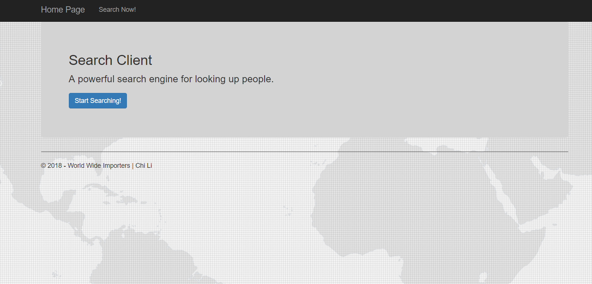
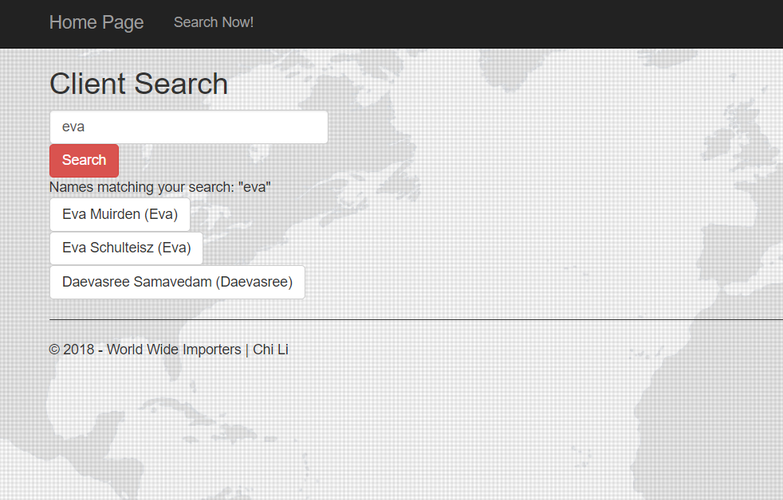
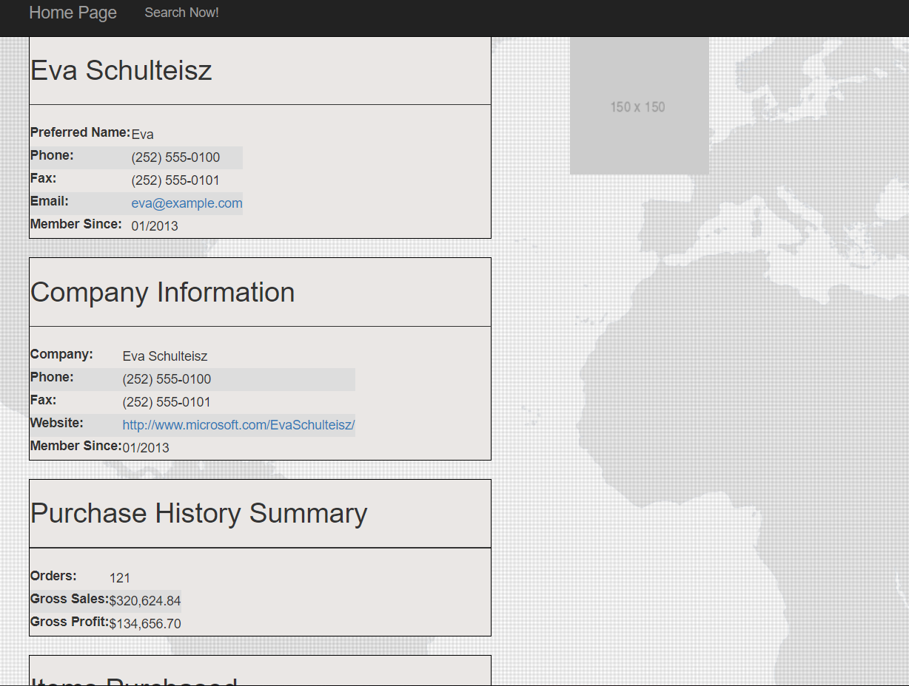
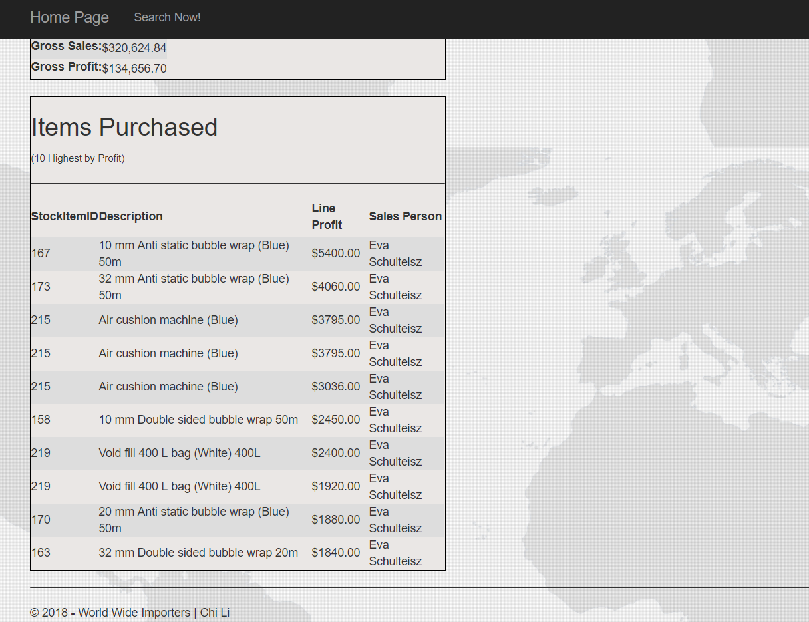
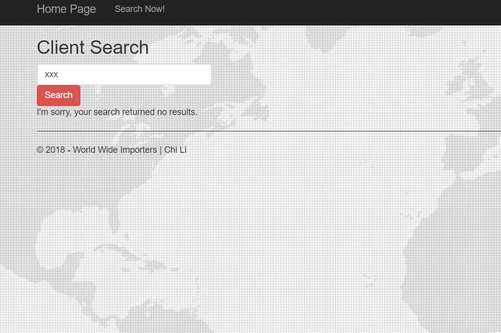

### Homework 6: MVC & Existing Database
For this assignment, we were asked to create an interactive MVC search engine application where the search result come from an existing database.

## Files
* [HW6 Code](https://github.com/cli16/cli16.github.io/tree/master/CS460/hw6)
* [CS460 repo](https://github.com/cli16/cli16.github.io/tree/master/CS460)

### Getting Started
For this assignment, we were asked to use only Viusal Studio Community 2017 IDE. I downloaded the IDE by going to [Visual Studio IDE](https://visualstudio.microsoft.com/downloads/) . After I installed Visual Studio, I created my program by choosing the "Web -> ASP.NET Web Application(.NET FrameWork)" option and then I choose the MVC option.
The second tool that we need is to install [LINQPad](https://www.linqpad.net/), which is very helpful for testing out the lamba commands and the existing database. I also installed Microsoft SQL Server Management Studio and use it to restore and further examinate the existing database.

### First Step
The first step is getting the existing database to work on local server. In this step I didn't install any of the SQL servers like the Microsoft SQL Server Express. I just used my computer local server by using this connection string:
```
(LocalDB)\MSSQLLocalDB
```

### getting the database data
After I restored the existing database using the Microsoft SQL Server Management Studio and created my MVC application using the default template. I implement the app to work with the existing database by going to Model->(Right click)-> Add -> New Item -> ADO.NET Entity Data Model -> Code First From database, and add in the above connection string.
After I added the existing database, I added in the code below, to call and extract the data from the database.
```
      public EFWideWorldImportersContext database = new EFWideWorldImportersContext();
```
the code above works great for the first part of the assignment, since we only need to extract data from one table.

### Search function
For the search page and its function, I write a form that take in the user input and send the data to the server using the POST method since I thinkk that hte url is clear to read without the QueryStrings in the url. I then in the HomeCotroller.cs I write the following code:

Search page 's HomeController Code:
```C#

        //default get page
        [HttpGet]
        public ActionResult Search()
        {
            return View();
        }

        //POST method page when user submit something, use the passed in input (clientName)
        [HttpPost]
        public ActionResult Search(string clientName)
        {
            //check if the list is empty, display error if it is
            var clientResultCheck = database.People.Where(person => person.FullName.Contains(clientName)).ToList();
            if (clientResultCheck.Count() == 0)
            {
                ViewBag.resultText = "I'm sorry, your search returned no results.";
            }

            //check & see did user have inputted seomthing or not, by looking at the length of the input variable
            if (clientName.Length > 0 && clientResultCheck.Count() != 0)
            {
                //found atleast one record, client is not empty 
                ViewBag.clientNameIsEmpty = false;

                //set the result text
                ViewBag.resultText = "Names matching your search: " + "\"" + clientName + "\"";

                //query to get check if a record contains clientName in the People table & convert it into a list
                var clientResult = database.People.Where(person => person.FullName.Contains(clientName)).ToList();


                //pass back the result Model into the View
                //use var, since if don't know/easier what type is returning back    
                return View(clientResult);
            }
            return View();
        }

```

Search View Page Code:
```C#
@model IEnumerable<hw6.Models.Person>

@{
    ViewBag.Title = "Search";
}

<h2>Client Search</h2>

<body background="~/Content/Background/world-bg.jpg">
</body>

@*when user submited the query, use POST instead of GET to hide the query show from the user*@
@*using razer code to create the form for inputs *@
@using (Html.BeginForm("Search", "Home", FormMethod.Post))
{
    @*clientName obj to send to server*@
    @Html.TextBox("clientName", null, htmlAttributes: new
{
   @class = "form-control",
   type = "text",
   placeholder = "Search by client name"
   })

    @* submit button to post the inputs to the server *@
    <button type="submit" display="inline-block" class="btn btn-danger">Search</button>
}


@*if method is POSTed(user submitted), and result is empty display no results found ViewBag*@
@if (IsPost && Model == null)
{

    @ViewBag.resultText
}

@*if method is POSTed(user submitted), and clientName is false (aka, is not empty)*@
@if (IsPost && ViewBag.clientNameIsEmpty == false)
{
    @ViewBag.resultText

    //using var for easier data handling & loop thru each object in the result model
    foreach (var personObject in Model)
    {
        <br>
        //@url.Action to return an url instead of HTML tags

        //search buttom with client preferred name
        <a class="btn btn-default" href="@Url.Action("Person", "Home", new { id=personObject.PersonID })">@personObject.FullName (@personObject.PreferredName) </a>
    }

}
```

### Company Information function
In my opinion, this part is the hardest and took me alot of time to figure out what to do. For this part, Since we are passing more than one table objects. I create a new ViewModel and added this:

PersonDashboardVM:
```
using System;
using System.Collections.Generic;
using System.Linq;
using System.Web;
using System.ComponentModel.DataAnnotations;

namespace hw6.Models.ViewModels
{
    public class PersonDashboardVM
    {
        //we need the person table object from the database
        public Person Person { get; set; }

        //we need the Customer table object from the database
        public Customer Customer { get; set; }

        public List<InvoiceLine> InvoiceLine { get; set; }

        public int TotalOrders { get; set; }

        [DisplayFormat(DataFormatString ="{0:C}")]
        public decimal GrossSales { get; set; }

        [DisplayFormat(DataFormatString ="{0:C}")]
        public decimal GrowthProfit { get; set; }
    }
}
```

and added this line of code in the top of the Controller:
```
using hw6.Models.ViewModels; //import model to use database references
```

Person Controller code:
```
 //For Person details page, use custom PersonDashboard ViewModel to pass in multiple table objects instead of default one.
        public PersonDashboardVM vm = new PersonDashboardVM();

        //get the clientID, use int? since the variable maybe null
        public ActionResult Person(int? id)
        {
            //----- if not passing an parameter-----
            //parse out the clientID, then convert string to int
            //string path = Request.Url.AbsoluteUri;
            //string clientIdString = path.Split('/').Last();
            //int clientId = Int32.Parse(clientIdString);

            //default check if the client is also a customer (company check)
            ViewBag.companyExists = false;


            //check and see if the client exist in the database
            var clientCheckExist = database.People.Find(id);


            if (clientCheckExist == null)
            {
                ViewBag.client = "Error: Client does not exist in the database.";
            }

            //send the People object into vm.Person
            vm.Person = database.People.Find(id);

            //check if that person is also an customer of the company.
            if (vm.Person.Customers2.Count() > 0) //if their count is great than 0
            {
                //show the tables in View
                ViewBag.companyExists = true;

                //show the company info table, use First() instead of FirstOrDefault, because it have atleast one element
                //get the customer ID from Customers2 
                int customerID = vm.Person.Customers2.First().CustomerID;
                vm.Customer = database.Customers.Find(customerID);

                //get the purchase history info
                //count up the number of orders
                ViewBag.totalOrders = vm.Customer.Orders.Count;

                //sum up all the extendedprice in invoices -> InvoiceLines as decimal
                vm.GrossSales = vm.Customer.Orders.SelectMany(item => item.Invoices).SelectMany(item => item.InvoiceLines).Sum(item => item.ExtendedPrice);

                vm.GrowthProfit = vm.Customer.Orders.SelectMany(item => item.Invoices).SelectMany(item => item.InvoiceLines).Sum(item => item.LineProfit);

                //same as above except, getting 10 items from the lineProfit and convert it to list
                vm.InvoiceLine = vm.Customer.Orders.SelectMany(item => item.Invoices).SelectMany(item => item.InvoiceLines).OrderByDescending(item => item.LineProfit).Take(10).ToList();
            }

            //else it exists, send the client info object into the view.
            return View(vm);
        }
```

Person ViewModel Code
```

@model hw6.Models.ViewModels.PersonDashboardVM


@{
    ViewBag.Title = "Person Data";
}

@ViewBag.client

<body background="~/Content/Background/world-bg.jpg">
</body>

@*parse suburl *@
<div class="row">
    <div class="col-md-6">
        <div class="client_info">
            <h2>@Html.DisplayFor(model => model.Person.FullName)</h2>
            <hr />
            <table>
                <tr>
                    <td>@Html.Label("Preferred Name: ")</td>
                    <td>@Html.DisplayFor(model => model.Person.PreferredName)</td>
                </tr>
                <tr>
                    <td>@Html.Label("Phone: ")</td>
                    <td>@Html.DisplayFor(model => model.Person.PhoneNumber)</td>
                </tr>
                <tr>
                    <td>@Html.Label("Fax: ") </td>
                    <td>@Html.DisplayFor(model => model.Person.FaxNumber)</td>
                </tr>
                <tr>
                    <td>@Html.Label("Email: ") </td>
                    <td><a href="mailto:@Model.Person.EmailAddress">@Html.DisplayFor(model => model.Person.EmailAddress)</a></td>
                </tr>
                <tr>
                    <td>@Html.Label("Member Since: ") </td>
                    <td>@string.Format("{0:MM/yyyy}", Convert.ToDateTime(Html.DisplayFor(model => model.Person.ValidFrom).ToString()))</td>
                </tr>
            </table>
        </div>
    </div>
    <div class="col-md-6">
        @*client photo*@
        <p></p>
    </div>
</div>

<br />

@*Company info*@
@*might need a true/false check for company employee*@

@if (ViewBag.companyExists == true)
{
    <div class="row">
        <div class="col-md-6">
            <div class="company_info">
                <h2>Company Information</h2>
                <hr />
                <table>
                    <tr>
                        <td>
                            @Html.Label("Company: ")
                        </td>
                        <td>
                            @Html.DisplayFor(model => model.Customer.CustomerName)
                        </td>
                    </tr>
                    <tr>
                        <td>
                            @Html.Label("Phone: ")
                        </td>
                        <td>
                            @Html.DisplayFor(model => model.Customer.PhoneNumber)
                        </td>
                    </tr>
                    <tr>
                        <td>
                            @Html.Label("Fax: ")
                        </td>
                        <td>
                            @Html.DisplayFor(model => model.Customer.FaxNumber)
                        </td>
                    </tr>
                    <tr>
                        <td>
                            @Html.Label("Website: ")
                        </td>
                        <td>
                            <a href="@Model.Customer.WebsiteURL">@Html.DisplayFor(model => model.Customer.WebsiteURL)</a>
                        </td>
                    </tr>
                    <tr>
                        <td>
                            @Html.Label("Member Since: ")
                        </td>
                        <td>
                           @string.Format("{0:MM/yyyy}", Convert.ToDateTime(@Html.DisplayFor(model => model.Customer.ValidFrom).ToString()))
                        </td>
                    </tr>
                </table>
            </div>
        </div>
    </div>

    <br />

    <div class="row">
        <div class="col-md-6">
            <div class="company_info">
                <h2>Purchase History Summary</h2>
                <hr />
                <table>
                    <tr>
                        <td>@Html.Label("Orders: ")</td>
                        <td>@Html.DisplayFor(model => model.TotalOrders)</td>
                    </tr>
                    <tr>
                        <td>@Html.Label("Gross Sales: ")</td>
                        <td>@Html.DisplayFor(model => model.GrossSales)</td>
                    </tr>
                    <tr>
                        <td>@Html.Label("Gross Profit: ")</td>
                        <td>@Html.DisplayFor(model => model.GrowthProfit)</td>
                    </tr>
                </table>
            </div>
        </div>
    </div>

    <br />

    //item purchased table
    <div class="row">
        <div class="col-md-6">
            <div class="company_info">

                <h2>Items Purchased</h2> <h6><span>(10 Highest by Profit)</span></h6>

                <hr />
                <table>
                    <tr>
                        <th>@Html.Label("StockItemID")</th>
                        <th>@Html.Label("Description")</th>
                        <th>@Html.Label("Line Profit")</th>
                        <th>@Html.Label("Sales Person")</th>
                    </tr>


                    @*loop thru each item*@
                    @foreach (var item in Model.InvoiceLine)
                    {
                        <tr>
                            @*list out all the data*@
                            <td>@Html.DisplayFor(tableItem => item.StockItemID)</td>
                            <td>@Html.DisplayFor(tableItem => item.Description)</td>
                            <td>$@Html.DisplayFor(tableItem => item.LineProfit)</td>
                            <td>@Html.DisplayFor(tableItem => item.Invoice.Person.FullName)</td>
                        </tr>
                    }
                </table>
            </div>
        </div>
    </div>
}
```
For the InvoiceLines, I created a list and take 10 things from the database and put it into a List as seen in the code above.

### Screenshots & Video
[Video Demo](https://youtu.be/2wpsJ7rDyVY)







 