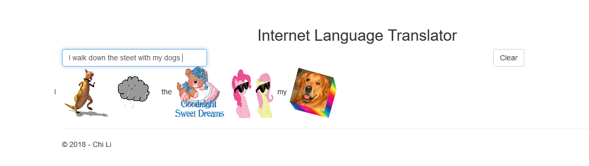
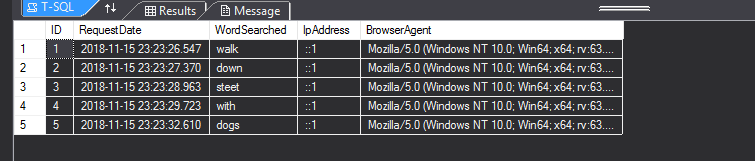
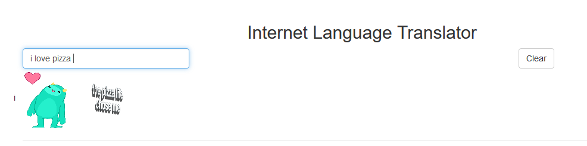

### Homework 7: MVC & Ajax
For this assignment, we were asked to write an MVC application that recieve data without refreshing the page by using Jquery, Ajax, and API.

## Files
* [HW7 Code](https://github.com/cli16/cli16.github.io/tree/master/CS460/hw7)
* [CS460 repo](https://github.com/cli16/cli16.github.io/tree/master/CS460)
* [Video Demo](https://youtu.be/YRCyrzuKFCg)


### Getting Started
For this assignment, we were asked to use only Viusal Studio Community 2017 IDE. I downloaded the IDE by going to [Visual Studio IDE](https://visualstudio.microsoft.com/downloads/) . After I installed Visual Studio, I created my program by choosing the "Web -> ASP.NET Web Application(.NET FrameWork)" option and then I choose the MVC + Empty option.

### First step
The first and one of the most import part of this project is to get an API key from giphy. You could get one for signing up at their website. Then I stored my secret API key in an config file on my computer and make sure to not push it into github by storing it outside of my respositary folder.
my config file code:
```
<appSettings>
  <add key="CS460-APIkey" value="SUPER_SECRET_API_KEY" />
</appSettings>
```
and i make sure that in my API call function, the function read the api key only from the config file that I created, and store the translated results into the database.
```
using System;
using System.Collections.Generic;
using System.Linq;
using System.Web;
using System.Web.Mvc;
using System.Net;
using System.Data;
using System.Data.Entity;
using hw7.DAL;
using hw7.Models;
namespace hw7.Controllers
{
    public class APIController : Controller
    {
        private InfoContext db = new InfoContext();

        //press in the word to translate in to gif  
        //get data from gifhy

        //use "id" to get userinput
        public JsonResult Translate(string id)
        {
            //setup the structure of the api url          
            string api_Key = System.Web.Configuration.WebConfigurationManager.AppSettings["CS460-APIkey"];
            string api_Url = ("https://api.giphy.com/v1/stickers/translate?api_key=" + api_Key + "&s=" + id);

            //get the data from the url
            var jsonData = new WebClient().DownloadString(api_Url);

            //convert the string downloaded into json format
            var jsonSerialize = new System.Web.Script.Serialization.JavaScriptSerializer();
            var testing = jsonSerialize.DeserializeObject(jsonData);

            //--save to database--
            //create an Infos stucture
            Info DatabaseObj = new Info();
            DatabaseObj.WordSearched = id;
            DatabaseObj.currentDate = DateTime.Now;
            DatabaseObj.IpAddress = Request.UserHostAddress;
            DatabaseObj.BrowserAgent = Request.UserAgent;
            db.Infos.Add(DatabaseObj);
            db.SaveChanges();
            
            //return back the json data 
            return Json(testing, JsonRequestBehavior.AllowGet);
        }
    }
}
```

### JQuery
For the javascript, I think I spent the most of my time here writing out this part. In order to detect if the user have pressed "space" or not , i use jquery's keyup function to check if keycode 32 is pressed or not, by placing the function inside the .ready(function())
```
 $(document).keyup(function (objEvent) {
        //if objEvent is true, := else
        (objEvent) ? keycode = objEvent.keyCode : keycode = event.keyCode;
        //check if space is passed, aka keycode = 32
        if (keycode == 32) {
		}
```

In order if the user have entered boring words, I created a array of boring words that a user might type, like this:
```
 var boringWords = ["i", "me", "you", "the", "we", "them", "take", "say", "in", "on", "like", "their", "I'm", "so", "for", "are",
        "then", "here", "out", "very", "not", "and", "am", "to", "going", "my", "what", "your", "yours", "his", "her", "him", "she", "he", "got", "want"];
```

and then the function loop thru the array of boringWords to see if the user have enter an interesting word or an boring word:
```
    for (var counter = 0; counter < boringWords.length; counter++) {
                if (userInputs.toLowerCase() == boringWords[counter].toLowerCase()) {
                    console.log("Word: " + "\"" + userInputs + "\"" + " is a boring word!")
                    $("#output").append(userInputs + " ");
                    isBoringWord = true;
                    break;
                    //break out of the loop, so it wont keep checking for this word
                }
                console.log(isBoringWord)
            }
            if (isBoringWord == false ) {
                apiCall(userInputs);
            }
        }
```

the overall of my Jquery code look like this: 
```
var dataArray = [];
var indexCounter = 0; //counter for checking for words

function requestData(data) {
    //extract the image url out of the json data
    console.log(data.data.images.original.url);
    var pictureUrl = data.data.images.original.url;

    //append the img to the output
    $("#output").append("");

}

function clears() {
    //reset all
    dataArray = [];
    indexCounter = 0;
    $("#UserInputBox").val("");
    $("#output").empty();
    console.log("cleared & reset all the variables");
}

function errorOnAjax() {
    console.log("ERROR: Couldn't connect to the API.")
}

function apiCall(word) {
    //api call url
    var source = "/API/translate/" + word;

    //use ajax to get the data from the api
    $.ajax({
        type: "GET",
        dataType: "json",
        url: source,
        success: requestData,
        error: errorOnAjax
    });
}

//after page finished loading, run this function
$(document).ready(function () {
    //var dataArray = [];
    //var indexCounter = 0; //counter for checking for words
    var isBoringWord = false;
    var boringWords = ["i", "me", "you", "the", "we", "them", "take", "say", "in", "on", "like", "their", "I'm", "so", "for", "are",
        "then", "here", "out", "very", "not", "and", "am", "to", "going", "my", "what", "your", "yours", "his", "her", "him", "she", "he", "got", "want"];

    $(document).keyup(function (objEvent) {
        //if objEvent is true, := else
        (objEvent) ? keycode = objEvent.keyCode : keycode = event.keyCode;
        //check if space is passed, aka keycode = 32
        if (keycode == 32) {
            //create a array and push it everytime user press space
            var userInputTemp = $("#UserInputBox").val();
            var userInputs = userInputTemp.substring(indexCounter, userInputTemp.length - 1)

            //extract the exact word that the user inputted
            indexCounter += (userInputs.length) + 1;

            console.log(indexCounter)
            //indexCounter = 0; //reset counter after finish

            //length-1 to get rid of the space
            dataArray.push(userInputs);

            //print out debug info
            console.log(dataArray);
            isBoringWord = false;
            //after finished check each letter
            //loop thru the boringWord array, if userInput is contained in the array and send the word to the API
            for (var counter = 0; counter < boringWords.length; counter++) {
                if (userInputs.toLowerCase() == boringWords[counter].toLowerCase()) {
                    console.log("Word: " + "\"" + userInputs + "\"" + " is a boring word!")
                    $("#output").append(userInputs + " ");
                    isBoringWord = true;
                    break;
                    //break out of the loop, so it wont keep checking for this word
                }
                console.log(isBoringWord)
            }
            if (isBoringWord == false ) {
                apiCall(userInputs);
            }
        }
    });
});
```

### API Controller
Unlike previous assignments, we are only have a single View, which is the user Input page and nothing else. so therefore, the API controller doesn't have a view page. and by using Ajax I was able to call the API controller to return the json data and parse it using:
```
var jsonSerialize = new System.Web.Script.Serialization.JavaScriptSerializer();
var testing = jsonSerialize.DeserializeObject(jsonData);
```			

### Database
For this assignment, we were asked to store the user translated result into the database. therefore I crated a database Model and wrote this code to declare the structure of the database:
```
  [Key]
        public int ID { get; set; }

        public DateTime currentDate = DateTime.Now;

        public DateTime RequestDate {
            get { return currentDate; }
            set { currentDate = value; }
        }

        public string WordSearched { get; set; }

        public string IpAddress { get; set; }

        public string BrowserAgent { get; set; }
```

and then added in the database connection string into the Web.config file
```
  <connectionStrings>
    <add name="Infos" connectionString="Data Source=(LocalDB)\MSSQLLocalDB;AttachDbFilename=<mdf database file path>;Integrated Security=True" providerName="System.Data.SqlClient" />
  </connectionStrings>
```

### Custom Routing Path
I created a custom routing path(API/WordToPicture/<string>). So, everytime go to the url:.../API/WordToPicture<string>, there will be routed to the translator API:
```
          routes.MapRoute(
                name: "Translate",
                url: "API/WordToPicture/{id}",
                defaults: new { controller = "API", action = "Translate", id = UrlParameter.Optional }
            );
```

### Screenshots & Video
[Video Demo](https://youtu.be/YRCyrzuKFCg)





